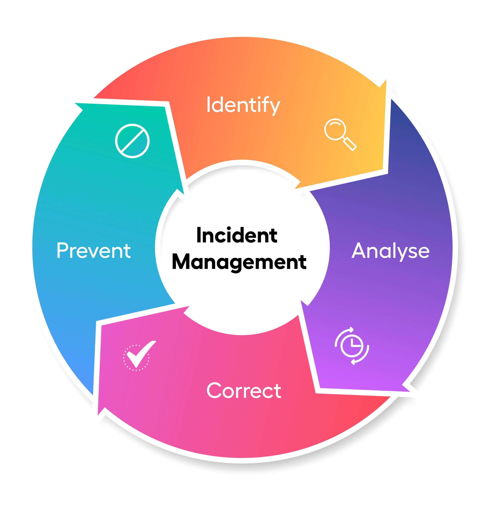
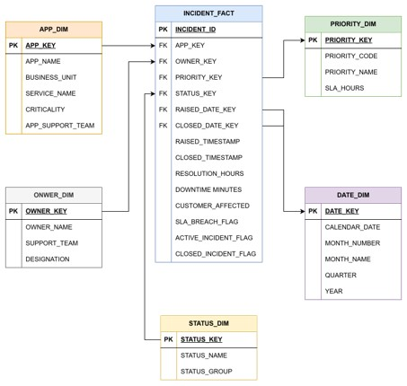

# Incident Management Analyst Agent

An AI-powered incident management assistant built with **Snowflake Cortex Analyst**.

The agent understands the incident management data model and answers business questions in natural English. It translates questions into governed SQL, runs the query in Snowflake, and returns clear, data-backed results—without requiring users to write SQL.

---

<p align="center">
  
</p>

---

## Cortex Analyst — Natural Language to SQL

**Services:** Semantic View + Cortex Agent (`cortex_analyst_text_to_sql` tool)

Business users can ask questions such as:

> “Which applications have high downtime but low incident count?”

The agent uses the Semantic View to understand the business context, generates SQL, executes it on a Snowflake warehouse, and returns the result conversationally.

### Key Features

- **Semantic View** defines business logic through metrics, dimensions, relationships, and synonyms.
- **Governed SQL generation** ensures questions are answered using the approved data model.
- **Synonyms** support natural phrasing such as *ticket*, *issue*, or *incident*.
- **Business-friendly metrics** simplify analysis of SLA compliance, downtime, customer impact, and workload.
- **Multi-turn conversations** allow users to continue their analysis in Snowflake CoWork.

---

## Incident Management Data Model



The model follows a star-schema design. `INCIDENT_FACT` stores one row per incident and connects to the supporting dimensions.

### Dimensions

| Table | Purpose |
|---|---|
| `APP_DIM` | Application details including business unit, service, criticality, and support team. |
| `OWNER_DIM` | Engineer details including support team and designation. |
| `PRIORITY_DIM` | Incident priority and SLA target hours. |
| `STATUS_DIM` | Current incident status such as Open, In Progress, Closed, or Cancelled. |
| `DATE_DIM` | Calendar attributes for raised-date analysis. |

### Fact Table

| Table | Grain | Key Measures |
|---|---|---|
| `INCIDENT_FACT` | One row per incident | Resolution hours, downtime minutes, customers affected, SLA breach flag, active incident flag, and closed incident flag. |

---

## Questions the Agent Can Answer

Using this data model, the agent can answer questions such as:

- Which applications have high downtime but low incident count?
- Which engineers resolve incidents quickly while handling the highest workload?
- Which support team has the highest SLA compliance?
- Which critical applications rarely fail?
- Show P4 and P5 incidents that breached SLA.
- Which support team owns the highest-risk active backlog?
- Which business unit has the highest customer impact?

---
## Setup

### Option 1: Step-by-Step Setup

Run the scripts in this order in your snowflake account:

1. `01_setup_data_model/01_create_db_schema_warehouse.sql`
2. `01_setup_data_model/02_create_dimensions.sql`
3. `01_setup_data_model/03_create_facts.sql`
4. `02_setup_cortex_analyst/01_create_semantic_view.sql`
5. `02_setup_cortex_analyst/02_create_agent.sql`
6. `02_setup_cortex_analyst/03_test_agent_queries.sql`

### Option 2: Consolidated Setup

For a quicker setup, run the scripts in `consolidated_setup/`:

1. `00_full_setup.sql`
2. `01_cortex_analyst_semantic_view_and_agent.sql`

---

## Cost Control

The project uses a dedicated `XSMALL` warehouse with auto-suspend enabled. The `cost_monitoring/` folder includes scripts to check warehouse credits, estimate cost, and create a Resource Monitor.

## Cleanup

Run the script below to remove the project objects when they are no longer required:

```text
cleanup/cleanup_objects.sql
```

Review the cleanup script before executing it because it may drop the project database, warehouse, Semantic View, Agent, and related objects.

---

Built to demonstrate how governed semantic models and AI agents can make IT incident analytics easier for business and operations teams.
